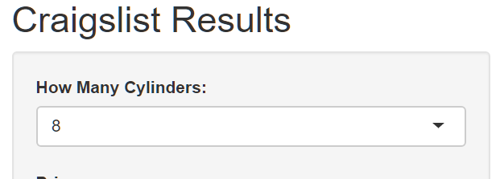
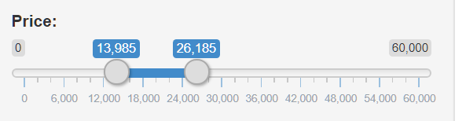

```{r setup, include=FALSE}
knitr::opts_chunk$set(echo = TRUE, message=FALSE, warning=FALSE)
```


```{r}
library(tidyverse)
library(rvest)
library(robotstxt)
library(shiny)
```

## Shiny App Discussion
My project is used to find the count on the prices of vehicles on Craigslist. The interesting thing on this is that it can be expanded to finding cars in your price range based on how many cylinders you’re looking for. If time permitted, this could be expanded to all items on craigslist. I chose this project because I use Craigslist a lot in searching for miscellaneous things.

I figured vehicles would be an interesting topic based on the fact that they can be sorted very finely. I included 4 cylinder, 6 cylinder, and 8 cylinder vehicles because they are the most common. I wanted to figure a way to include the mtcars data set in order to include data for gas mileage. For instance, one could factor in the average costs of an 8 cylinder vehicle and include data from the mtcars data set in order to see gas mileage and predict costs over time associated with gas mileage. I wanted to include the ability for total budget over time to be entered, and find the cars on Craigslist that would fit that budget with the gas mileage multiplied by the average mileage of a car per year factored in to cost. To expand on that a little more, a user could enter in a $5,000 budget for 5 years. The average miles driven in Wisconsin per year is 15,188. The average gas mileage for an 8 cylinder car is 18. This math provides 844 gallons of fuel used in a year. The average gas price in Wisconsin is $1.98, so I would subtract $1,670.68 from the $5,000 budget. This would look for cars in the price range of $3,329.32 and below.

The exciting thing is how expandable this topic is. All the searches are by default sorted by new, so if someone was under a crunch to find a car they could run this every day until they get a car on their budget. Besides cars, the program could implement searching for anything in a price range, and could include condition based on how the user enters it. A drawback to web scraping from Craigslist is that the listing names come in exactly how the user types them. After browsing Craigslist for a while, I’ve noticed a lot of times people will bloat their title in order to come up with more search results. This can be problematic when you’re scraping because of the bloat that is needed to be removed. This will be unique in every case because every user will enter their item in differently. A way around this, given enough time, would be to have a database of vehicle names that the web scrape could see and compare against to only keep keywords that matter. For example, if a title is “Chevrolet Cruze brand new!” the database would contain the words “Chevrolet” and “Cruze” and remove the rest of the bloat from the scrape.

{width=500px}
{width=500px}

##Technical Discussion
To complete this project, I used mainly web scraping. In order to verify that the website was allowed to be scraped I used robotstxt. I used functions in the program often to keep the code clear and concise. Listings takes in the page that you’re working with (there are 3 pages, one for each cylinder of a vehicle) and scrapes the page given. After scraping it returns the results as a vector. Prices, similarly to Listings, takes in a page and scrapes the results. After scraping the results of the given web page it returns a vector of the results.
	In order to keep the code clean the functions allowed one chunk of code to be used rather than three (one for each page). With the idea of expanding the project, these functions are imperative to keep the code clean, or there would need to be a scraping call to EVERY single page included. The last function I used, Combine, also takes in a page. Combine is called with the page in mind and then calls both Listings and Prices. It saves the results given by each and combines them into a data frame. The beauty in these functions is that if the program had time to be expanded, the only function that would need to be changed is Combine (to include more functions that may be added). Prices and Listings will work for any page that they are given. So if the user wanted to search for tables for sale, the page passed to Combine would just have to be the URL for pages. 
	Not much cleaning of the scrape was used. The only thing that Craigslist bloated was the price sign on its price results. I did notice that there are two places Craigslist has prices (one on the top left corner of the image, and one next to the name). The price next to the name was on every result so I opted to use that one. Creating the data frame was a must in being able to graph the data returned.
	In creating the Shiny App, I used the tools for the UI and server. The UI contains a select input and a slider range input. The select allows the user to choose the amount of cylinders in the car, while the slider range input allows the user to choose a certain price range to see how many cars there are in that range. The idea of using the selections was brought in mind with the graph. For instance, dataFilter (a variable used to pass into the graph) is changed by If statements. The If statement find which data the user selected and calls Combine on the corresponding page. In the bar graph plot itself, it uses the slider range output to change the limits of the x. This limits the prices that are shown to a range that the user selects. I wanted to be able to click on the graph and display the names of the listings that went into making the count, but unfortunately ran out of time. I did find, however that this would have been possible using interactive plots. 


```{r}
paths_allowed(
  domain = "https://appleton.craigslist.org/"
)
```

Used for separating listings on different pages
```{r}
Listings <- function(page) {
  listingsReturn <- page %>%
  html_nodes(".hdrlnk") %>%
  html_text() %>%
  trimws() %>%
  as.character()
  return(listingsReturn)
}
```

```{r}
Prices <- function(page) {
  pricesReturn <- page %>%
  html_nodes(".result-meta .result-price") %>%
  html_text() %>%
  str_remove_all("\\$") %>%
  as.numeric()
  return(pricesReturn)
}
```

```{r}
Combine <- function(page) {
  returnedListings <- Listings(page)
  returnedPrices <- Prices(page)
  combinedData <- data.frame("Listing" = returnedListings, "Price" = returnedPrices)
  return(combinedData)
}

```
##### 2) Read in the url. 

```{r}
page8Cyl <- read_html("https://appleton.craigslist.org/search/cta?auto_cylinders=5")
page6Cyl <- read_html("https://appleton.craigslist.org/search/cta?auto_cylinders=4")
page4Cyl <- read_html("https://appleton.craigslist.org/search/cta?auto_cylinders=2")
```


Listing/Price as on Craigslist
```{r}
listings8Cyl <- Listings(page8Cyl)
listings6Cyl <- Listings(page6Cyl)
listings4Cyl <- Listings(page4Cyl)

prices8Cyl <- Prices(page8Cyl)
prices6Cyl <- Prices(page6Cyl)
prices4Cyl <- Prices(page4Cyl)
dataframe <- Combine(page4Cyl)
head(dataframe)
```

```{r}
# Define UI for application 
ui <- fluidPage(
   
   # Application title
   titlePanel("Craigslist Results"),
   
   # Sidebar with a slider input for number of bins 
   sidebarLayout(
      sidebarPanel(
        
         selectInput("cylinder",
                     "How Many Cylinders:",
                     c("4", "6", "8")),
         sliderInput("price",
                     "Price:",
                     min = 0,
                     max = 60000,
                     value = c(0,1000))
      ),
      
      # Show a plot of the generated distribution
      mainPanel(
         plotOutput("distPlot")
      )
   )
)

# Define server logic required to draw a histogram
server <- function(input, output) {
   
   output$distPlot <- renderPlot({
      # generate bins based on input$bins from ui.R
      num_bins <- 20
      
      if(input$cylinder == "4"){
        dataFilter <- Combine(page4Cyl)
      }
      else if(input$cylinder == "6"){
        dataFilter <- Combine(page6Cyl)
      }
      else if(input$cylinder == "8"){
        dataFilter <- Combine(page8Cyl)
      }
      
      
      # draw the histogram with the specified number of bins
      ggplot(data = dataFilter, width = 0.1) + 
        geom_bar(aes(x = Price), color="blue") +
        xlab("Price") + ylab("Count") + xlim(input$price[1], input$price[2])
      })
}

# Run the application 
shinyApp(ui = ui, server = server)
```
